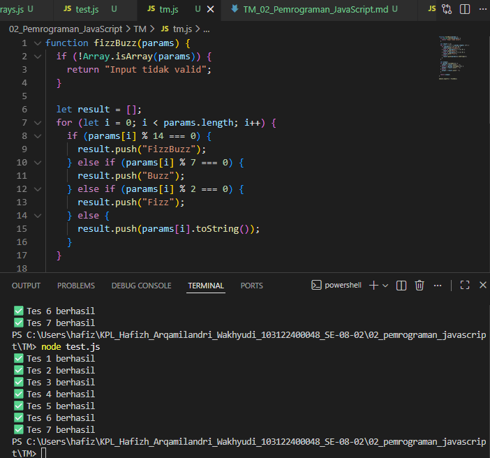

# Tugas Pendahuluan 02: Pemrograman JavaScript

**Nama:** Hafizh Arqamilandri Wakhyudi
**NIM:** 103122400044
**Kelas:** SE-08-02

## Tugas

Buatlah sebuah fungsi bernama fizzBuzz yang menerima input larik (array) dan mengembalikan deretan bilangan dan "Fizz" untuk kelipatan 2, "Buzz" untuk kelipatan 7, dan "FizzBuzz" untuk kelipatan 14. Beri nama berkas program sebagai tm.js dan taruh di direktori TM.

**Kode sumber**

Tersedia di 
[test.js](test.js)

[tm.js](tm.js)

**Output**



**Deskripsi Program**

Untuk javascript fizzBuzz ini terdapat sebuah parameter berupa array. Fungsi ini bertugas memproses setiap angka di dalam array dan diubah lagi sesuai aturan tertentu, setelahnya mengembalikan hasil dalam bentuk string. Setelah itu, fungsi tersebut diekspor menggunakan module.exports agar bisa dipanggil dan diuji dari file lain seperti test.js.

```
if (!Array.isArray(params)) {
  return "Input tidak valid";
}
```
fungsi yang memvalidasi dari input

Bagian ini digunakan untuk memastikan bahwa parameter yang diberikan benar-benar berupa array. Jika nilai yang dikirim bukan array, maka fungsi tidak akan melanjutkan proses dan langsung mengembalikan teks "Input tidak valid". Selanjutnya dibuat sebuah array kosong bernama result yang akan digunakan untuk menyimpan hasil pengolahan setiap elemen dari array params.
```
let result = [];
```
Setelah itu dilakukan perulangan menggunakan for loop untuk mengecek setiap elemen yang ada di dalam array params.
```
for (let i = 0; i < params.length; i++) {
```
Di dalam perulangan tersebut dilakukan pengecekan menggunakan operator modulus % untuk mengetahui apakah suatu angka merupakan kelipatan dari angka tertentu. Jika angka tidak memenuhi semua kondisi tersebut, maka angka asli dimasukkan ke dalam result, tetapi terlebih dahulu diubah menjadi string menggunakan .toString(). cara ini setiap angka pada params akan diubah sesuai aturan sebelum dimasukkan ke dalam array hasil. Setelah seluruh elemen selesai diproses, langkah berikutnya adalah menentukan bagaimana hasil array result akan digabung menjadi sebuah string.
```
let output;
if (params.includes(1)) {
  output = result.join(", ");
} else if (params.includes(-1)) {
  output = result.join(", ");
} else {
  output = result.join(" ");
}
```
Pada bagian ini digunakan metode includes() untuk memeriksa apakah array params mengandung angka 1 atau -1. Jika array berisi 1 atau -1, maka elemen-elemen dalam result akan digabung menggunakan pemisah koma dan spasi ", ". Jika tidak ada kedua nilai tersebut, maka hasil akan digabung menggunakan spasi " " sebagai pemisah. Terakhir, nilai output yang sudah digabung tersebut dikembalikan sebagai hasil dari fungsi.
```
return output;
```
