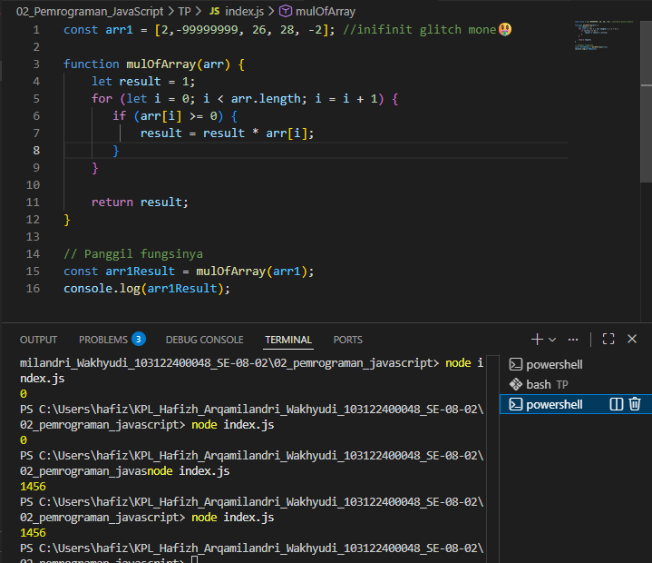

# Tugas Pendahuluan 02: Pemrograman JavaScript

**Nama:** Hafizh Arqamilandri Wakhyudi
**NIM:** 103122400044
**Kelas:** SE-08-02

## Tugas

Kamu sudah menulis fungsi mulOfArray. Ujilah dengan input [2, 0, 26, 28, -2], dengan output yang seharusnya adalah 1456. Jika kamu menemukan bahwa hasilnya berbeda, bisakah kamu memperbaikinya? Jika kamu menemukan bahwa hasilnya sama, bisakah kamu menjelaskan mengapa demikian?
## Program/Kode
[index.js](index.js)

## Output
<<<<<<< HEAD
=======

>>>>>>> c482d49b25bb319948cf0ef3a351e042993acc98

## Deskripsi Program

Program ini menjalankan perkalian semua bilangan positif dalam larik (array). Ini akan bekerja untuk bilangan positif, nol, dan negatif.
