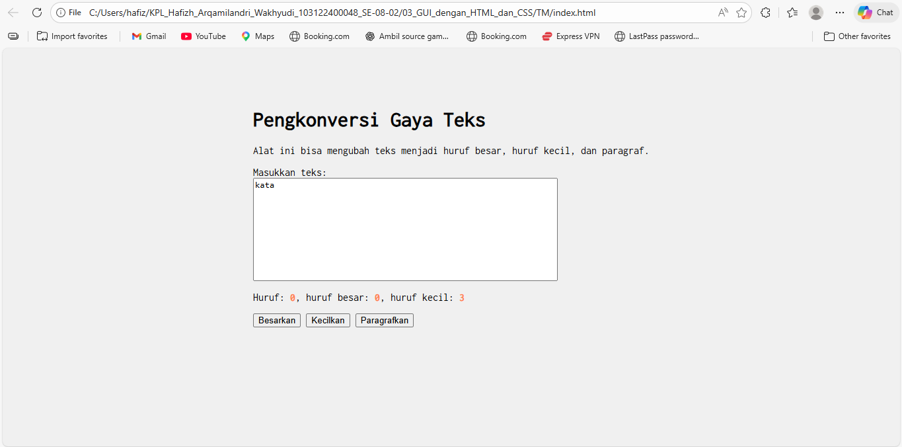

# Tugas Pendahuluan 03: GUI dengan HTML dan CSS

**Nama:** Hafizh Arqamilandri Wakhyudi

**NIM:** 103122400044

**Kelas:** SE-08-02

**Soal**

Setelah kamu menyelesaikan tugas pendahuluan (bisa buka di atas), terapkanlah fungsi untuk (1) menghitung huruf kecil yang disediakan di #hk, (2) mengubah huruf kecil ke huruf besar ketika pengguna menekan tombol #huruf-besar, dan (3) mengubah huruf besar ke huruf kecil ketika pengguna menekan tombol #huruf-kecil.

Untuk nomor 2 dan 3, tampilkan hasilnya di dalam editor-kecil.

Kemudian, hapuslah fitur "Paragrafkan" dari alat.

## Program/Kode

Tersedia di 
[index.js](index.js)

[index.html](index.html)

[index.css](index.css)

**Output**



**Deskripsi Program**
Untuk fitur seperti Besarkan dan Kecilkan bisa berjalan itu kita menambahkan perintah berikut pada index.js.

```
const editorElement = document.getElementById("editor-kecil");
const hurufKecilElement = document.getElementById("hk");

editorElement.addEventListener("input", (event) => {
    const text = event.target.value;
    
    let count = 0;
    for (let char of text) {
        if (char >= 'a' && char <= 'z') {
            count++;
        }
    }

    hurufKecilElement.textContent = count;
});

document.getElementById("huruf-besar").addEventListener("click", () => {
    editorElement.value = editorElement.value.toUpperCase();
});

document.getElementById("huruf-kecil").addEventListener("click", () => {
    editorElement.value = editorElement.value.toLowerCase();
});
```

Fungsi Hitung Huruf Kecil

Fitur ini berfungsi untuk menghitung jumlah huruf kecil (a–z) yang terdapat di dalam teks pada editor. Program akan memindai setiap karakter pada teks, kemudian mengecek apakah karakter tersebut termasuk huruf kecil. Jika huruh kecil maka jumlahnya akan ditambahkan dan hasil akhirnya akan ditampilkan pada bagian penghitung huruf kecil (hk).

Menggunakan perintah toUpperCase() yang fungsinya untuk memindai seluruh string di dalam kotak input dan mengubah setiap karakter alfabet menjadi huruf kapital.

Fungsi Kecilkan
Menggunakan perintah toLowerCase() yang fungsinya untuk memastikan semua huruf dalam teks berubah menjadi huruf kecil.
