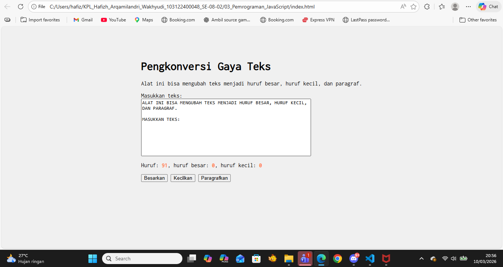

# Tugas Pendahuluan 03: GUI dengan HTML dan CSS

**Nama:** Hafizh Arqamilandri Wakhyudi
**NIM:** 103122400044
**Kelas:** SE-08-02

## Tugas

Buatlah tata letak laman yang kamu buat berada di tengah seperti di bawah ini, dan juga ubah font-nya dengan Inconsolata dari Google Fonts.

## Program/Kode

Tersedia di 
[index.js](index.js)

[index.html](index.html)

[index.css](index.css)

**Output**



**Deskripsi Program**
Untuk Mengubah teks menjadi google font itu kita cukup menambahkan link pada index.html
```
<link href="https://fonts.googleapis.com/css2?family=Inconsolata&display=swap" rel="stylesheet">
```
untuk implementasi google font nya itu bisa kita tambahkan di index.css dan untuk menjadikannya tampilan di tengah.

```
body {
            font-family: 'Inconsolata', monospace; 
            max-width: 600px;
            margin: 50px auto;
            padding: 20px;
        }
```
agar tombol seperti besarkan,kecilkan,pargraf itu kita menambahkan perintah ini pada index.js

```
const editorElement = document.getElementById("editor-kecil");
const charCountElement = document.getElementById("hf");

editorElement.addEventListener("input", (event) => {
    const textLength = event.target.value.length;
    charCountElement.textContent = textLength;
});

document.getElementById("huruf-besar").addEventListener("click", () => {
    editorElement.value = editorElement.value.toUpperCase();
});

document.getElementById("huruf-kecil").addEventListener("click", () => {
    editorElement.value = editorElement.value.toLowerCase();
});

document.getElementById("huruf-paragraf").addEventListener("click", () => {
    let teks = editorElement.value.toLowerCase();
    editorElement.value = teks.charAt(0).toUpperCase() + teks.slice(1);
});
```
Fungsi Besarkan: Menggunakan perintah toUpperCase() yang fungsinya itu untuk memindai seluruh string di dalam kotak input dan mengubahnya setiap karakter alphabet menjadi huruf kapital.

Fungsi Kecilkan: Menggunakan perintah toLowerCase() fungsinya itu untuk memastikan semua huruf dalam teks berubah menjadi huruf kecil.

Fungsi Paragrafkan: Menggunakan teknik manipulasi string yang sedikit lebih spesifik. Pertama itu, dia akan ubah teks jadi kecil semua dan ambil karakter pertama menggunakan charAt(0) untuk diperbesar dengan toUpperCase(). Setelah itu, karakter pertama yang sudah diperbesar digabungkan lagi dengan sisa teks lainnya menggunakan slice(1).
