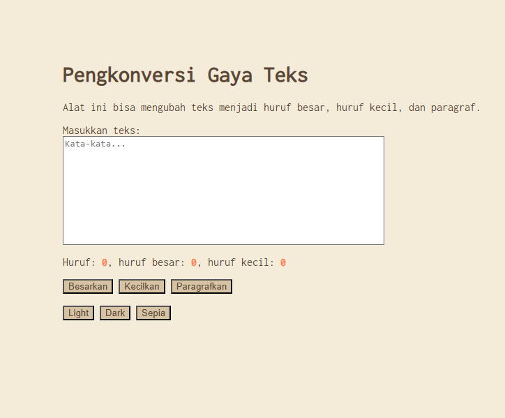

# Tugas Mandiri 04: GUI dengan HTML dan CSS - MODE SEPIA

**Nama:** Hafizh Arqamilandri Wakhyudi

**NIM:** 103122400044

**Kelas:** SE-08-02

**Soal**

Tambahkan mode sepia dengan ketentuan:

Elemen	Warna
Latar belakang	#F4ECD8
Warna teks	#5B4636
Biarkan form tetap warna putih.

1.Bagian mode-div harus menaungi tiga button: light, dark, dan sepia
2.Bisa berpindah state secara mulus: sepia menghasilkan sepia-mode, dark menghasilkan dark-mode, dan light menghasilkan light-mode

Untuk menghapus pinggiran tombol, nyatakan properti border untuk tidak ditunjukkan.

## Program/Kode

Tersedia di 
[index.js](index.js)

[index.html](index.html)

[index.css](index.css)

**Output**



**Deskripsi Program**
 Untuk menambahkan fitur mode sepia, kita bisa membuat class CSS bernama .sepia-mode pada index.css terlebih dahulu:
```
body.sepia-mode {
    background-color: #F4ECD8;
    color: #5B4636;
}

body.sepia-mode button {
    background-color: #D6C3A3;
    color: #5B4636;
}
```
ini digunakan untuk mengubah warna latar belakang dan teks menjadi nuansa sepia sesuai ketentuan.

Selain itu, textarea tetap dibuat berwarna putih agar sesuai instruksi:
```
textarea {
    background-color: #ffffff;
    color: #000;
}
```
lalu kita tambahkan 3 button di <html> dan bungkus dalam satu container mode-div:
```
<div class="mode-div">
    <button id="tombol-terang">Light</button>
    <button id="tombol-gelap">Dark</button>
    <button id="tombol-sepia">Sepia</button>
</div>
```
ini digunakan agar semua tombol mode berada dalam satu bagian yang sama.

Selanjutnya, pada index.js, kita menambahkan interaksi menggunakan addEventListener untuk mengatur class pada elemen <body>:

```
const buttonLightElement = document.getElementById("tombol-terang");
const buttonDarkElement = document.getElementById("tombol-gelap");
const buttonSepiaElement = document.getElementById("tombol-sepia");

buttonLightElement.addEventListener("click", () => {
    document.body.classList.remove("dark-mode", "sepia-mode");
});

buttonDarkElement.addEventListener("click", () => {
    document.body.classList.remove("sepia-mode");
    document.body.classList.add("dark-mode");
});

buttonSepiaElement.addEventListener("click", () => {
    document.body.classList.remove("dark-mode");
    document.body.classList.add("sepia-mode");
});
```