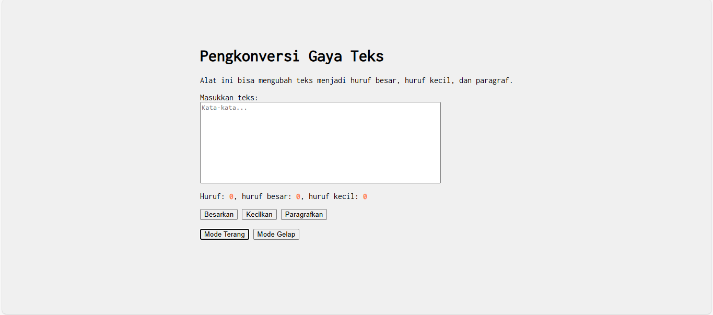
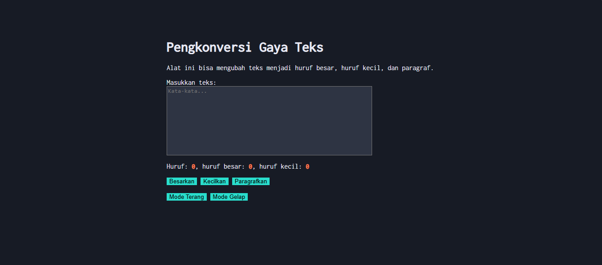

# Tugas Pendahuluan 04: GUI dengan HTML dan CSS

**Nama:** Hafizh Arqamilandri Wakhyudi

**NIM:** 103122400044

**Kelas:** SE-08-02

**Soal**

Tambahkan mode gelap sekaligus untuk editor-kecil dan tombol-tombolnya. Ketentuan warna untuk latar belakang editor-kecil adalah #2e3443, sementara untuk tombol adalah #29ddcc. Teks untuk tombol tetap mengikuti warna teks sebelumnya.

Untuk menghapus pinggiran tombol, nyatakan properti border untuk tidak ditunjukkan.

## Program/Kode

Tersedia di 
[index.js](index.js)

[index.html](index.html)

[index.css](index.css)

**Output**




**Deskripsi Program**
 Untuk menambahkan fitur mode gelap, itu kita bisa membuat class CSS bernama .dark-mode pada index.css nya terlebih dahulu:
```
.dark-mode body {
    background-color: #171b25;
    color: #EBECF7;
}

.dark-mode #editor-kecil {
    background-color: #2e3443;
    color: #EBECF7;
}

.dark-mode button {
    background-color: #29ddcc;
    color: #000;
    border: none;
}
```

ini  digunakan untuk mengubah warna latar belakang, teks, textarea, dan tombol ketika mode gelap aktif.

lalu kita tambahkan 2 button di <html> untuk mengaktifkan mode terang dan mode gelap:
```
<button id="tombol-terang">Mode Terang</button>
<button id="tombol-gelap">Mode Gelap</button>
```
Selanjutnya, pada index.js, kita menambahkan interaksi menggunakan addEventListener untuk mengatur class pada elemen <html>:
```
const buttonLightElement = document.getElementById("tombol-terang");
const buttonDarkElement = document.getElementById("tombol-gelap");

buttonLightElement.addEventListener("click", () => {
    document.documentElement.classList.remove("dark-mode");
});

buttonDarkElement.addEventListener("click", () => {
    document.documentElement.classList.add("dark-mode");
});
```
jadi cara kerjanya itu ketika tombol Mode gelap di click, class dark-mode akan implementasi ke <html> jadinya itu mengubah semua tampilan ke mode gelap.
