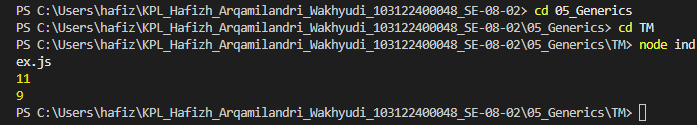

# Tugas Pendahuluan 05: Generics

**Nama:** Hafizh Arqamilandri Wakhyudi

**NIM:** 103122400044

**Kelas:** SE-08-02

**Soal**

Bagaimana caramu hanya dengan satu fungsi generik bisa mengurus keduanya?

Agar fungsi yang kamu kerjakan benar atau tidak, berikut ini adalah kode tes yang bisa kamu tempelkan:

## Program/Kode

Tersedia di 
[index.js](index.js)

**Output**



**Deskripsi Program**
Untuk menggabungkan perhitungan jumlah semua karakter dan jumlah huruf, kita bisa membuat satu fungsi generik bernama hitung pada file JavaScript terlebih dahulu:
```
function hitung(teks, mode) {
    let jumlah = 0;

    for (const c of teks) {
        if (mode === "huruf" && c === ' ') {
            continue;
        }
        jumlah++;
    }

    return jumlah;
}
```
ini digunakan untuk menghitung jumlah karakter berdasarkan mode yang diberikan, yaitu "semua" untuk menghitung semua karakter, dan "huruf" untuk menghitung karakter tanpa spasi.

lalu kita buat variabel teks yang akan dihitung:
```
const str = "Bar bar bar";
```
ini digunakan sebagai input yang akan diproses oleh fungsi hitung.

Selanjutnya, kita panggil fungsi tersebut untuk dua kondisi berbeda:
```
console.log(
   hitung(str, "semua") 
);

console.log(
  hitung(str, "huruf") 
);
```
ini digunakan untuk menampilkan hasil perhitungan jumlah semua karakter dan jumlah huruf tanpa spasi ke console.

Terakhir, kita juga bisa memanggil fungsi tanpa menampilkan hasilnya:
```
hitung(str, "huruf"); 
```
ini menunjukkan bahwa fungsi tetap berjalan, tetapi karena tidak menggunakan console.log, maka hasilnya tidak ditampilkan.