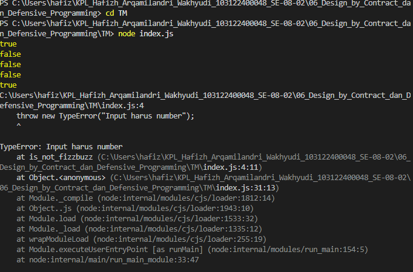

# Tugas Mandiri 06: Design by Contract dan Defensive Programming

**Nama:** Hafizh Arqamilandri Wakhyudi

**NIM:** 103122400044

**Kelas:** SE-08-02

**Soal**

Lindungi kode ini dari bilangan-bilangan "fizz buzz"!

Tugasmu adalah membuat fungsi yang menolak bilangan-bilangan kelipatan 3, 5, atau 15, menerima bilangan-bilangan bukan "fizz buzz", dan melempar yang bukan bilangan bulat.

## Program/Kode

Tersedia di 
[index.js](index.js)

**Output**



**Deskripsi Program**
Untuk menerapkan aturan FizzBuzz, kita bisa membuat satu fungsi bernama zzzzOrNum pada file JavaScript terlebih dahulu:
```
function zzzzOrNum(value) {
    if (!Number.isInteger(value)) {
        throw new Error("Input harus bilangan bulat");
    }

    if (value % 15 === 0) return "FizzBuzz";
    if (value % 3 === 0) return "Fizz";
    if (value % 5 === 0) return "Buzz";

    return value;
}
```
ini digunakan untuk mengubah satu bilangan menjadi "Fizz", "Buzz", "FizzBuzz", atau tetap menjadi angka sesuai aturan yang berlaku.

lalu kita buat fungsi kedua bernama fizzBuzz:
```
function fizzBuzz(sequence) {
    if (!Array.isArray(sequence)) {
        throw new Error("Input harus berupa array");
    }

    const newSequence = sequence.map((e) => zzzzOrNum(e));

    return newSequence;
}
```
ini digunakan untuk memproses sebuah array yang berisi bilangan bulat, kemudian mengubah setiap elemennya menggunakan fungsi zzzzOrNum.

Selanjutnya, kita buat variabel array yang akan diproses:
```
const data = [1, 2, 3, 4, 5];
```
ini digunakan sebagai input yang akan diproses oleh fungsi fizzBuzz.

Kemudian, kita panggil fungsi tersebut:
```
console.log(
   fizzBuzz(data)
);
```
ini digunakan untuk menampilkan hasil perubahan array berdasarkan aturan FizzBuzz ke console.

Terakhir, kita juga bisa memanggil fungsi tanpa menampilkan hasilnya:
```
fizzBuzz(data);
```
ini menunjukkan bahwa fungsi tetap berjalan, tetapi karena tidak menggunakan console.log, maka hasilnya tidak ditampilkan.