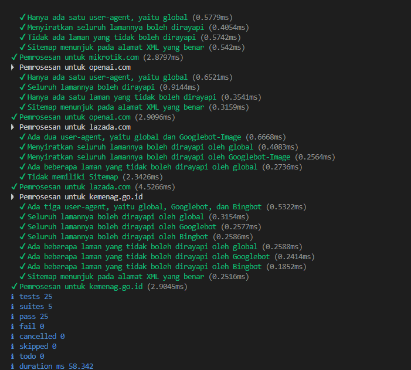

# Tugas Mandiri 07: Grammar based Input Processing

**Nama:** Hafizh Arqamilandri Wakhyudi

**NIM:** 103122400044

**Kelas:** SE-08-02

**Soal**

Uraikan robot!

Tugas pada kesempatan kali ini adalah membuat fungsi yang menguraikan isi robots.txt menjadi POJO (plain old JavaScript object). Empat properti yang perlu diuraikan dijabarkan di bawah berikut.

User-agent adalah nama robot perayapnya
Allow adalah daftar halaman-halaman yang boleh dirayap
Disallow adalah daftar halaman-halaman yang tidak boleh dirayap
Sitemap adalah sebuah pranala yang menunjuk pada "denah" situs web (biasanya berformat XML)
Kamu akan mengerjakannya di dalam sebuah fungsi bernama parseRobots di index.js dan. Buka direktori 07 di sini untuk mengunduh berkas yang dimaksud, berkas-berikas robots.txt di dalam direktori daftar, dan berkas pengujiannya yaitu test.js.

## Program/Kode

Tersedia di 
[index.js](index.js)

**Output**



**Deskripsi Program**
Untuk program parseRobots ini terdapat sebuah parameter berupa string teks yang diambil dari file robots.txt. Fungsi ini bertugas untuk menguraikan isi teks tersebut menjadi sebuah objek JavaScript (POJO) yang berisi informasi tentang User-agent, Allow, Disallow, dan Sitemap. Setelah itu, fungsi tersebut diekspor menggunakan module.exports agar bisa dipanggil dan diuji dari file lain seperti test.js.
```
const lines = text.split("\n");
```
Bagian ini digunakan untuk memecah teks robots.txt menjadi beberapa baris berdasarkan karakter newline (\n). Hasilnya adalah array lines yang berisi setiap baris dari teks sehingga lebih mudah untuk diproses satu per satu.
```
const result = {
    agents: {},
    Sitemap: []
};
```
Selanjutnya dibuat sebuah objek result yang akan digunakan untuk menyimpan hasil parsing. Objek ini memiliki dua properti utama yaitu agents untuk menyimpan aturan tiap user-agent dan Sitemap untuk menyimpan daftar URL sitemap.
```
let currentAgents = [];
```
Variabel ini digunakan untuk menyimpan user-agent yang sedang aktif diproses. Hal ini penting karena aturan Allow dan Disallow harus dimasukkan ke user-agent yang sesuai.

for (let line of lines) {

Dilakukan perulangan untuk membaca setiap baris dari array lines.
```
line = line.trim();
if (!line || line.startsWith("#")) continue;
```
Pada bagian ini dilakukan pembersihan spasi di awal dan akhir baris menggunakan trim(). Jika baris kosong atau merupakan komentar (ditandai dengan #), maka baris tersebut dilewati dan tidak diproses lebih lanjut.
```
const [rawKey, ...rest] = line.split(":");
const key = rawKey.trim().toLowerCase();
const value = rest.join(":").trim();
```
Baris kemudian dipisahkan menjadi dua bagian yaitu key dan value berdasarkan tanda titik dua (:). Key diubah menjadi huruf kecil agar memudahkan proses pencocokan, sedangkan value adalah isi dari aturan tersebut.
```
if (key === "user-agent") {
    const agent = value.toLowerCase();
    currentAgents = [agent];

    if (!result.agents[agent]) {
        result.agents[agent] = {
            Allow: [],
            Disallow: []
        };
    }
}
```
Jika key adalah user-agent, maka program akan menyimpan nama user-agent ke dalam currentAgents. Jika user-agent tersebut belum ada di dalam objek result.agents, maka akan dibuatkan objek baru dengan properti Allow dan Disallow berupa array kosong.
```
else if (key === "allow") {
    if (!value) continue;

    for (const agent of currentAgents) {
        result.agents[agent].Allow.push(value);
    }
}
```
Jika key adalah Allow, maka nilai path akan dimasukkan ke dalam array Allow milik user-agent yang sedang aktif. Jika value kosong, maka akan dilewati.
```
else if (key === "disallow") {
    if (!value) continue;

    for (const agent of currentAgents) {
        result.agents[agent].Disallow.push(value);
    }
}
```
Jika key adalah Disallow, maka nilai path akan dimasukkan ke dalam array Disallow milik user-agent yang sedang aktif. Sama seperti sebelumnya, jika kosong maka tidak akan dimasukkan.
```
else if (key === "sitemap") {
    if (value) result.Sitemap.push(value);
}
```
Jika key adalah Sitemap, maka URL sitemap akan dimasukkan ke dalam array Sitemap karena sifatnya global dan tidak bergantung pada user-agent tertentu.
```
return result;
```
Setelah seluruh baris selesai diproses, objek result yang berisi hasil parsing akan dikembalikan sebagai output dari fungsi.