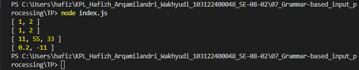

# Tugas Mandiri 05: Generics

**Nama:** Hafizh Arqamilandri Wakhyudi

**NIM:** 103122400044

**Kelas:** SE-08-02

**Soal**

Buatlah fungsi yang mengubah deretan angka bertipe string menjadi larik angka.

## Program/Kode

Tersedia di 
[index.js](index.js)

**Output**



**Deskripsi Program**
Untuk membuat fungsi yang dapat mengubah input berupa string atau array string menjadi array angka, kita membuat fungsi toNumberArray terlebih dahulu.
```
function toNumberArray(number) {
  let arr;

  if (typeof number === "string") {
    arr = number.split(",");
  } else {
    arr = number;
  }

  return arr
    .map(item => Number(item.trim())) 
    .filter(item => !isNaN(item));   
}
```
fungsi ini digunakan untuk mengolah input yang bisa berupa string seperti "1, 2" atau array seperti ["1", "2"] menjadi array angka.

lalu pada bagian dalam fungsi, kita melakukan pengecekan tipe data menggunakan typeof.
```
if (typeof number === "string") {
  arr = number.split(",");
} else {
  arr = number;
}
```
bagian ini berfungsi untuk memastikan bahwa jika input berupa string, maka akan dipecah terlebih dahulu menjadi array menggunakan split(","). Jika sudah berupa array, maka langsung digunakan tanpa diubah.

selanjutnya, kita mengubah setiap elemen menjadi angka dan membersihkan data:
```
return arr
  .map(item => Number(item.trim())) 
  .filter(item => !isNaN(item));
```
.map() digunakan untuk mengubah setiap elemen string menjadi angka dengan Number() serta menghilangkan spasi dengan trim().
.filter() digunakan untuk menghapus nilai yang bukan angka (NaN), misalnya seperti "abc23".

terakhir, kita bisa mencoba fungsi tersebut dengan beberapa contoh input:
```
console.log(toNumberArray("1, 2"))
console.log(toNumberArray(["1", "2"]))
console.log(toNumberArray(" 11,55,33   "))
console.log(toNumberArray(["0.2", "-11", "abc23"]))
```
jadi cara kerjanya itu ketika fungsi dipanggil, input akan diubah menjadi array, lalu setiap elemen dibersihkan dan dikonversi menjadi angka, kemudian nilai yang tidak valid akan dibuang sehingga menghasilkan array angka yang bersih.