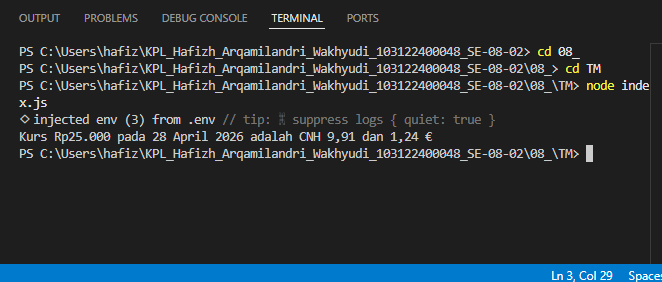

# Tugas Mandiri 08: Runtime Configuration dan Internationalization

**Nama:** Hafizh Arqamilandri Wakhyudi

**NIM:** 103122400044

**Kelas:** SE-08-02

**Soal**

Pada tugas ini kamu akan membuat program yang menampilkan kurs rupiah (IDR) terhadap renminbi luar Tiongkok (CNH) dan euro (EUR). Gunakan link API ini untuk mengambil data.

## Program/Kode

Tersedia di 
[index.js](index.js)

**Output**



**Deskripsi Program**
Untuk menampilkan kurs Rupiah (IDR) terhadap Renminbi (CNH) dan Euro (EUR) dengan format internasional, kita membuat program menggunakan dotenv untuk konfigurasi dan Intl untuk pemformatan.

```
require('dotenv').config();
const BASE_API = process.env.BASE_API;

async function konversiMataUang(jumlahRupiah) {
    const response = await fetch(BASE_API);
    const data = await response.json();
    
    // Proses kalkulasi dan formatting...
}
```
Program ini digunakan untuk mengambil data nilai tukar terbaru dari API luar, lalu menghitung dan memformat hasilnya agar mudah dibaca oleh pengguna sesuai standar lokal Indonesia.

Pada bagian awal, memuat variabel lingkungan menggunakan dotenv:

```
require('dotenv').config();
const BASE_API = process.env.BASE_API;
```
Bagian ini berfungsi untuk mengambil URL API yang disimpan secara terpisah di dalam berkas .env. Hal ini dilakukan agar data sensitif atau konfigurasi URL tidak tertulis langsung di dalam kode program (hardcoded).

Selanjutnya, mengambil data dari API menggunakan fetch:
```
const response = await fetch(BASE_API);
const data = await response.json();
````
Bagian ini berfungsi untuk mengirim permintaan ke server penyedia data kurs. Hasilnya berupa data JSON yang berisi nilai tukar mata uang IDR terhadap berbagai mata uang dunia lainnya.

Kemudian, memformat tanggal dan angka menggunakan Intl:
```
const tanggalLokal = new Intl.DateTimeFormat('id-ID', { 
  day: 'numeric', month: 'long', year: 'numeric' 
}).format(new Date(data.date));

const formatIDR = new Intl.NumberFormat('id-ID', {
  style: 'currency', currency: 'IDR', minimumFractionDigits: 0
}).format(jumlahRupiah);
```
Bagian ini digunakan untuk mengatur tampilan output:

id-ID memastikan penggunaan bahasa Indonesia (misal: "April" bukan "April" bahasa Inggris).

style: 'currency' otomatis menambahkan simbol "Rp" pada angka Rupiah.

minimumFractionDigits mengatur jumlah angka di belakang koma agar sesuai standar masing-masing mata uang.

Terakhir, menampilkan hasil konversi ke konsol:

```
console.log(`Kurs ${formatIDR} pada ${tanggalLokal} adalah CNH ${formatCNH} dan ${formatEUR} €`);
```
Bagian ini menggabungkan semua data yang telah diproses menjadi satu kalimat informasi yang utuh.

Jadi cara kerjanya adalah ketika program dijalankan, sistem mengambil URL API dari .env, menarik data kurs terbaru, menghitung nilai konversi berdasarkan input user, memformat angka dan tanggal ke standar Indonesia, lalu menampilkan hasilnya secara rapi di layar.