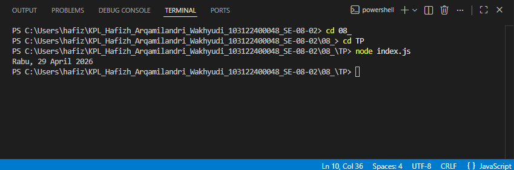

# Tugas Pendahuluan 08: Runtime Configuration dan Internationalization

**Nama:** Hafizh Arqamilandri Wakhyudi

**NIM:** 103122400044

**Kelas:** SE-08-02

**Soal**

Tampilkan tanggal sekarang dengan format seperti ini:
```
Sabtu, 18 April 2026
```
Nilai waktu tidak harus sama, asalkan formatnya benar dan bisa tampil di komputer terpisah pada waktu tertentu. Gunakan Intl.DateTimeFormat

## Program/Kode

Tersedia di 
[index.js](index.js)

**Output**



**Deskripsi Program**
Untuk menampilkan tanggal saat ini dengan format bahasa Indonesia seperti "Sabtu, 18 April 2026", kita membuat program menggunakan Intl.DateTimeFormat.
```
const now = new Date();

const formatter = new Intl.DateTimeFormat('id-ID', {
  weekday: 'long',
  day: 'numeric',
  month: 'long',
  year: 'numeric'
});

console.log(formatter.format(now));
```
program ini digunakan untuk mengambil tanggal sekarang dari sistem, lalu memformatnya agar sesuai dengan format penulisan tanggal.

lalu pada bagian awal, mengambil waktu saat ini menggunakan objek Date:
```
const now = new Date();
```
bagian ini berfungsi untuk mendapatkan tanggal dan waktu sekarang sesuai dengan sistem komputer yang menjalankan program.

selanjutnya, membuat formatter menggunakan Intl.DateTimeFormat:
```
const formatter = new Intl.DateTimeFormat('id-ID', {
  weekday: 'long',
  day: 'numeric',
  month: 'long',
  year: 'numeric'
});
```
bagian ini digunakan untuk mengatur format tanggal:

'id-ID' menunjukkan bahwa format menggunakan bahasa Indonesia
weekday: 'long' menampilkan nama hari lengkap (misalnya Sabtu)
day: 'numeric' menampilkan tanggal dalam angka
month: 'long' menampilkan nama bulan lengkap (misalnya April)
year: 'numeric' menampilkan tahun penuh

selanjutnya, menampilkan hasil format tanggal:
```
console.log(formatter.format(now));
```
formatter.format(now) akan mengubah objek tanggal menjadi string sesuai format yang sudah ditentukan sebelumnya.

terakhir, kita bisa menjalankan program dan hasilnya akan menampilkan tanggal saat ini, misalnya:
```
Sabtu, 18 April 2026
```
jadi cara kerjanya itu ketika program dijalankan, sistem akan mengambil waktu sekarang, lalu formatter akan mengubahnya menjadi format tanggal Indonesia yang lengkap, kemudian hasilnya ditampilkan ke console.