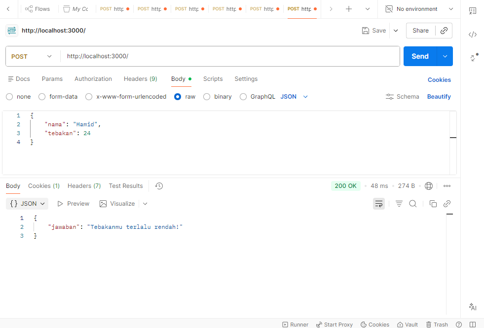

# Tugas Mandiri 09: API Design dan Construction Using Swagger

**Nama:** Hafizh Arqamilandri Wakhyudi

**NIM:** 103122400044

**Kelas:** SE-08-02

**Soal**

Mari kita main tebak-tebakan angka acak!

Tugasmu adalah membuat API yang terdiri dari satu endpoint saja, yaitu POST /. Ketika kita melakkukan POST, formatnya adalah seperti di bawah ini.
## Program/Kode

Tersedia di 
[index.js](index.js)


**Output**



**Deskripsi Program**
Untuk membuat API tebak-tebakan angka acak, kita membuat server menggunakan Express.js dengan satu endpoint POST /. API ini menerima request berupa JSON yang berisi nama dan tebakan pengguna.

Pertama, kita buat objek angkaAcakPerNama untuk menyimpan angka acak yang sudah dihasilkan per nama:

```
const angkaAcakPerNama = {};
```
Objek ini digunakan agar angka yang dihasilkan untuk nama yang sama tetap tidak berubah meskipun pengguna melakukan banyak request.

Selanjutnya, kita membuat fungsi generateRandomNumber(nama) untuk menghasilkan angka acak deterministik antara 1-100:

```
function generateRandomNumber(nama) {
    if (angkaAcakPerNama[nama] !== undefined) {
        return angkaAcakPerNama[nama];
    }
    
    let hash = 0;
    for (let i = 0; i < nama.length; i++) {
        hash = ((hash << 5) - hash) + nama.charCodeAt(i);
        hash = hash & hash;
    }
    
    const randomNumber = Math.abs(hash % 100) + 1;
    angkaAcakPerNama[nama] = randomNumber;
    return randomNumber;
}
```
Fungsi ini bekerja dengan:
Mengecek apakah nama sudah pernah muncul → jika ya, kembalikan angka yang sama
Menghitung hash dari string nama (case-sensitive) menggunakan pergeseran bit
Mengonversi hash menjadi angka antara 1-100 dengan Math.abs(hash % 100) + 1
Menyimpan angka yang dihasilkan untuk penggunaan berikutnya Kemudian, kita membuat endpoint POST / dengan validasi input:

```
app.post('/', (req, res) => {
    const { nama, tebakan } = req.body;
    
    // Validasi input
    if (!nama || typeof nama !== 'string') {
        return res.status(400).json({ error: "Nama harus diisi dan berupa string!" });
    }
    
    if (tebakan === undefined || typeof tebakan !== 'number') {
        return res.status(400).json({ error: "Tebakan harus diisi dan berupa angka!" });
    }
    
    if (tebakan < 1 || tebakan > 100) {
        return res.status(400).json({ error: "Tebakan harus antara 1-100!" });
    }
    
    const angkaBenar = generateRandomNumber(nama);
    
    if (tebakan === angkaBenar) {
        res.json({ jawaban: `Benar sekali! Tebakannya adalah ${angkaBenar}.` });
    } else if (tebakan > angkaBenar) {
        res.json({ jawaban: "Tebakanmu terlalu tinggi!" });
    } else {
        res.json({ jawaban: "Tebakanmu terlalu rendah!" });
    }
});
```
Validasi ini digunakan untuk memastikan: Nama harus diisi dan bertipe string,Tebakan harus diisi dan bertipe angka,Tebakan berada dalam rentang 1-100

Setelah validasi berhasil, API akan:
Mendapatkan angka benar dari fungsi generateRandomNumber(nama)
Membandingkan tebakan dengan angka benar

Mengembalikan response sesuai kondisi:
Sama → "Benar sekali! Tebakannya adalah X."
Lebih besar → "Tebakanmu terlalu tinggi!"
Lebih kecil → "Tebakanmu terlalu rendah!"
Terakhir, server dijalankan pada port 3000:
```
javascript
app.listen(PORT, () => {
    console.log(`Server berjalan di http://localhost:${PORT}`);
});
```