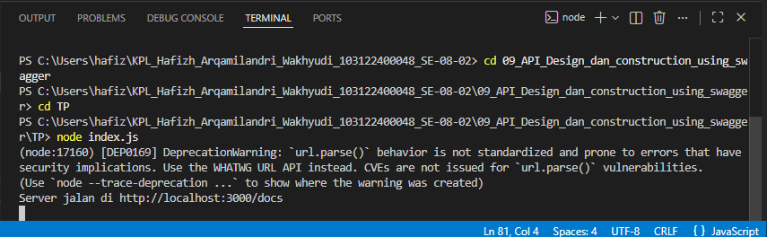
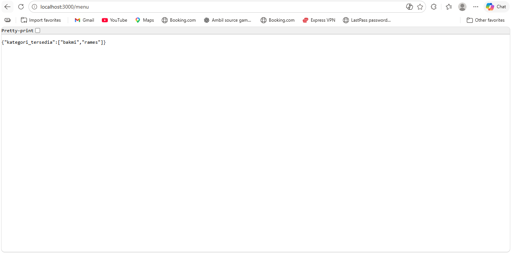
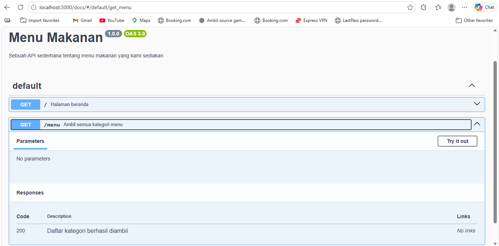

# Tugas Pendahuluan 09: API Design dan Construction Using Swagger

**Nama:** Hafizh Arqamilandri Wakhyudi

**NIM:** 103122400044

**Kelas:** SE-08-02

**Soal**
Buatlah satu endpoint lagi beserta dokumentasi OpenAPI-nya, yaitu GET /menu yang menampilkan daftar semua nama kategori menu yang ada.

## Program/Kode

Tersedia di 
[index.js](index.js)

**Output**
Running CLI

/menu

/docs


**Deskripsi Program**
Program ini dibuat untuk membangun sebuah REST API sederhana menggunakan framework Node.js yaitu Express.js, serta dilengkapi dengan dokumentasi API otomatis menggunakan Swagger melalui library swagger-jsdoc dan swagger-ui-express.

1. Konfigurasi Swagger (swagger.js)

Pertama, kita mengatur konfigurasi Swagger untuk mendokumentasikan API:
```
const options = {
  definition: {
    openapi: '3.0.0',
    info: {
      title: 'Menu Makanan',
      version: '1.0.0',
      description: 'Sebuah API sederhana tentang menu makanan yang kami sediakan',
    },
  },
  apis: ['./index.js'], 
};
```

properti apis berfungsi untuk membaca komentar berformat Swagger yang ada di file index.js.

selanjutnya, kita membuat spesifikasi Swagger:
```
const specs = swaggerJsdoc(options);
```
fungsi ini akan memproses konfigurasi dan komentar Swagger menjadi dokumentasi dalam format JSON.

terakhir, kita mengekspor konfigurasi tersebut:
```
module.exports = {
  specs,
  swaggerUi,
};
```
agar bisa digunakan di file lain, yaitu index.js.

2. Inisialisasi Server (index.js)

Program dimulai dengan membuat server menggunakan Express:
```
const express = require('express');
const app = express();
const PORT = 3000;
```
bagian ini berfungsi untuk membuat aplikasi server yang akan berjalan di port 3000.

lalu kita menghubungkan Swagger ke endpoint /docs:

app.use('/docs', swaggerUi.serve, swaggerUi.setup(specs));

sehingga dokumentasi API bisa diakses melalui:

http://localhost:3000/docs

3. Data Menu Makanan

Program ini memiliki data menu sederhana dalam bentuk objek:
```
const menuData = {
    bakmi: {
        "bakmi ayam spesial": 25000,
        "bakmi rica-rica": 28000,
        "bakmi komplit (bakso pangsit)": 35000
    },
    rames: {
        "nasi rames biasa": 15000,
        "nasi rames rendang": 25000,
        "nasi rames telur balado": 18000
    }
};
```
data ini berisi kategori makanan dan daftar menu beserta harganya.

4. Endpoint API
Endpoint Beranda 
```
app.get('/', (req, res) => {
    res.json({
        "pesan": "Cek /docs untuk melihat rincian API"
    });
});

endpoint ini digunakan untuk menampilkan pesan awal kepada pengguna.

```
app.get('/menu', (req, res) => {
    res.json({
        kategori_tersedia: Object.keys(menuData)
    });
});
```
endpoint ini berfungsi untuk mengambil semua kategori menu yang tersedia, seperti:

bakmi
rames

Object.keys() digunakan untuk mengambil nama kategori dari objek menuData.
```
Endpoint /menu/{category}
app.get('/menu/:category', (req, res) => {
    const category = req.params.category;
    const menu = menuData[category];

    if (menu) {
        res.json(menu);
    } else {
        res.status(404).json({ error: "Menu tidak ditemukan" });
    }
});
```
endpoint ini digunakan untuk mengambil daftar menu berdasarkan kategori.

parameter category diambil dari URL
program akan mencari data sesuai kategori tersebut
jika ditemukan, maka akan ditampilkan
jika tidak ditemukan, akan mengembalikan error 404

5. Dokumentasi API dengan Swagger

Setiap endpoint memiliki komentar khusus:
```
/**
 * @swagger
 * /menu:
 *   get:
 *     summary: Ambil semua kategori menu
 *     responses:
 *       200:
 *         description: Daftar kategori berhasil diambil
 */
```
komentar ini akan dibaca oleh Swagger dan ditampilkan dalam bentuk dokumentasi interaktif di /docs.