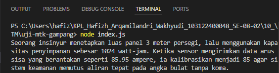

# Tugas Mandiri 10: Library Construction

**Nama:** Hafizh Arqamilandri Wakhyudi

**NIM:** 103122400044

**Kelas:** SE-08-02

**Soal**

Buatkan pustaka yang rapi!

Pada tugas ini buatlah sebuah proyek baru bernama mtk-gampang. Struktur proyeknya wajib diatur seperti di bawah ini.

|   index.js
|   package.json
\---lib
        pangkat.js
        bulat.js
        kuadrat.js
Setiap berkas lib hanya memiliki satu fungsi saja.

pangkat.js berisi fungsi pangkat(x, y) yang mengembalikan nilai akhir dari x pangkat y.
bulat.js berisi fungsi bulat(x) yang mengubah bentuk bilangan non-bulat menjadi bulat (mis. -4.25 menjadi -4) .
kuadrat.js berisi fungsi kuadrat(x) yang mengembalikan nilai akar kuadrat 2 dari x.

## Program/Kode

Tersedia di 
[index.js](./uji-mtk-gampang/index.js)


**Output**



**Deskripsi Program**
Untuk membuat pustaka mtk-gampang yang rapi, kita perlu mengatur struktur proyek dengan memisahkan setiap fungsi ke dalam berkasnya masing-masing di direktori lib.

Pertama, kita buat direktori lib yang berisi tiga berkas fungsi:

lib/pangkat.js:
```
export function pangkat(x, y) {
    return Math.pow(x, y);
}
```
Fungsi ini digunakan untuk menghitung hasil perpangkatan x pangkat y menggunakan Math.pow().

lib/bulat.js:
```
export function bulat(x) {
    return Math.trunc(x);
}
```
Fungsi ini digunakan untuk membulatkan bilangan dengan membuang bagian desimal (mendekati nol). Contohnya: -4.25 menjadi -4 dan 85.95 menjadi 85.

lib/kuadrat.js:

```
export function kuadrat(x) {
    return Math.sqrt(x);
}
```
Fungsi ini digunakan untuk menghitung akar kuadrat dari x menggunakan Math.sqrt().

Selanjutnya, kita buat berkas index.js sebagai pintu masuk utama pustaka:

```
import { pangkat } from './lib/pangkat.js';
import { bulat } from './lib/bulat.js';
import { kuadrat } from './lib/kuadrat.js';
export { pangkat, bulat, kuadrat };
```
Kode ini digunakan untuk mengimpor semua fungsi dari direktori lib dan mengekspornya kembali agar bisa diakses langsung dari pustaka tanpa perlu menyebutkan path lib/ masing-masing.

Kemudian, kita konfigurasi package.json dengan menambahkan:
```
json
{
  "name": "mtk-gampang",
  "version": "1.0.0",
  "main": "index.js",
  "type": "module"
}
```
Untuk menguji pustaka yang telah dibuat, kita buat proyek baru bernama uji-mtk-gampang dan instal pustaka mtk-gampang secara lokal:
```
npm install ../mtk-gampang
```

Kemudian kita buat index.js di proyek uji coba:

```
import { kuadrat, pangkat, bulat } from "mtk-gampang";

const narasi = `Seorang insinyur menetapkan luas panel ${bulat(kuadrat(12))} meter persegi, lalu menggunakan kapasitas penyimpanan sebesar ${pangkat(2, 10)} watt-jam. Ketika sensor mengirimkan data arus sisa yang berantakan seperti 85.95 ampere, ia kalibrasikan menjadi ${bulat(85.95)} agar sistem keamanan memutus aliran tepat pada angka bulat tanpa koma.`;

console.log(narasi);
```
Kode ini bekerja dengan:
Mengimpor fungsi kuadrat, pangkat, dan bulat dari pustaka mtk-gampang
Menghitung luas panel dengan bulat(kuadrat(12)): kuadrat(12) menghitung √12 ≈ 3.464, bulat(3.464) membulatkan menjadi 3 
Menghitung kapasitas penyimpanan dengan pangkat(2, 10) = 2^10 = 1024 Mengkalibrasi arus dengan bulat(85.95) = 85