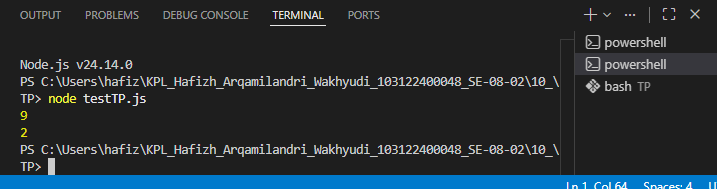

# Tugas Pendahuluan 10: Library Construction

**Nama:** Hafizh Arqamilandri Wakhyudi

**NIM:** 103122400044

**Kelas:** SE-08-02

**Soal**

Buatkan pustaka yang rapi!

Pada tugas ini buatlah sebuah proyek baru bernama mtk-gampang. Struktur proyeknya wajib diatur seperti di bawah ini.

|   index.js
|   package.json
\---lib
        pangkat.js
        bulat.js
        kuadrat.js
Setiap berkas lib hanya memiliki satu fungsi saja.

pangkat.js berisi fungsi pangkat(x, y) yang mengembalikan nilai akhir dari x pangkat y.
bulat.js berisi fungsi bulat(x) yang mengubah bentuk bilangan non-bulat menjadi bulat (mis. -4.25 menjadi -4) .
kuadrat.js berisi fungsi kuadrat(x) yang mengembalikan nilai akar kuadrat 2 dari x.

## Program/Kode

Tersedia di 
[index.js](./uji-mtk-gampang/index.js)


**Output**



**Deskripsi Program**
Untuk membuat pustaka hitung-teks yang berfungsi menghitung jumlah huruf dan kata dalam sebuah teks, kita membuat dua fungsi utama yang diekspor dari file index.js.
Pertama, kita buat fungsi hitungHuruf(teks) untuk menghitung jumlah huruf alfabet dalam teks:

```
export function hitungHuruf(teks) {
  const huruf = teks.match(/[a-zA-Z]/g);
  return huruf ? huruf.length : 0;
}
```
Fungsi ini bekerja dengan:

Menggunakan Regex pattern /[a-zA-Z]/g untuk mencocokkan semua huruf alfabet (A-Z baik besar maupun kecil) Method match() mengembalikan array yang berisi semua huruf yang ditemukan Jika ada huruf yang cocok (huruf tidak null), maka mengembalikan panjang array dengan huruf.lengthJika tidak ada huruf sama sekali, fungsi mengembalikan 0
Selanjutnya, kita buat fungsi hitungKata(teks) untuk menghitung jumlah kata dalam teks:

```
export function hitungKata(teks) {
  const kata = teks.match(/[a-zA-Z]+/g);
  return kata ? kata.length : 0;
}
```
Fungsi ini bekerja dengan:

Menggunakan Regex pattern /[a-zA-Z]+/g untuk mencocokkan satu atau lebih huruf alfabet yang berurutan (membentuk sebuah kata)
Tanda + berarti "satu atau lebih" huruf alfabet Method match() mengembalikan array yang berisi semua kata yang ditemukan Jika ada kata yang cocok, mengembalikan jumlah kata dengan kata.length Jika tidak ada kata, fungsi mengembalikan 0
Kemudian, kita konfigurasi package.json untuk pustaka ini:

```
{
  "name": "hitung-teks",
  "version": "1.0.0",
  "description": "Library untuk menghitung jumlah huruf dan kata",
  "main": "index.js",
  "author": "Fizz",
  "license": "ISC",
  "type": "module"
}
```
Pengaturan "type": "module" ini digunakan agar Node.js mengenali bahwa kita menggunakan ESM (ECMAScript Modules) sehingga mendukung sintaks export pada fungsi-fungsi di atas. Properti "main": "index.js" menandakan bahwa file index.js adalah entry point utama ketika pustaka ini dipanggil.

Untuk menggunakan pustaka ini, kita dapat mengimpornya ke dalam proyek lain:

```
import { hitungHuruf, hitungKata } from 'hitung-teks';

const teks = "Halo dunia 123!";

console.log(hitungHuruf(teks)); // Output: 9
console.log(hitungKata(teks));  // Output: 2
```