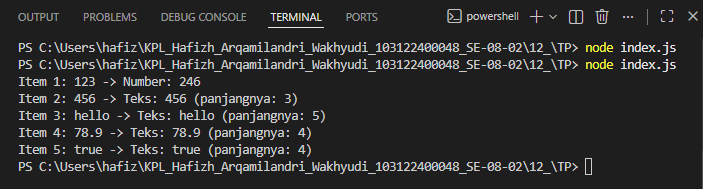

# Tugas Pendahuluan 12: Performance Analysis, Unit Testing, dan Debugging

**Nama:** Hafizh Arqamilandri Wakhyudi

**NIM:** 103122400044

**Kelas:** SE-08-02

**Soal**
```
Cobalah untuk menangkap kecacatan dalam kode ini

function main() {
  const data = [
    "123",
    456,
    "hello",
    78.9,
    true,
  ];

  for (let i = 0; i < data.length; i++) {
    const result = processData(data[i]);
    console.log(`Item ${i + 1}: ${data[i]} -> ${result}`);
  }
}

function processData(data) {
  const str = data.toLowerCase();
  const num = parseInt(str);
  if (!isNaN(num) && str === String(num)) {
    return `Number: ${num * 2}`;
  }
  return `Teks: ${str} (panjangnya: ${str.length})`;
}

main();
```
## Program/Kode

Tersedia di 
[index.js](index.js)


**Output**



**Deskripsi Program**
Untuk membuat program pengolah data yang dapat mengenali dan memproses berbagai tipe data seperti string, number, dan boolean, kita membuat dua fungsi utama yaitu main() dan processData().

Pertama, kita membuat fungsi main() sebagai fungsi utama program:
```
function main() {
  const data = [
    "123",
    456,
    "hello",
    78.9,
    true,
  ];

  for (let i = 0; i < data.length; i++) {
    const result = processData(data[i]);
    console.log(`Item ${i + 1}: ${data[i]} -> ${result}`);
  }
}
```
Fungsi ini bekerja dengan:

Membuat array data yang berisi beberapa tipe data berbeda seperti string, angka, dan boolean.
Menggunakan perulangan for untuk membaca setiap isi array satu per satu.
Setiap data dikirim ke fungsi processData() untuk diproses sesuai tipe datanya.
Hasil pengolahan kemudian ditampilkan menggunakan console.log() dengan format yang rapi.

Selanjutnya, kita membuat fungsi processData(data) untuk memproses data berdasarkan tipe datanya:
```
function processData(data) {
  if (typeof data === 'string') {
    const str = data.toLowerCase();
    const num = parseInt(str);

    if (!isNaN(num) && str === String(num)) {
      return `Number: ${num * 2}`;
    }

    return `Teks: ${str} (panjangnya: ${str.length})`;
  } 
  else if (typeof data === 'number') {
    return `Number: ${data * 2}`;
  }
  else if (typeof data === 'boolean') {
    return `Boolean: ${data}`;
  }
  else {
    return `Tipe tidak dikenal: ${typeof data}`;
  }
}
```
Fungsi ini bekerja dengan:

Menggunakan typeof untuk mengecek tipe data yang diterima.
Jika data bertipe string, maka string diubah menjadi huruf kecil menggunakan toLowerCase().
Kemudian program mencoba mengubah string menjadi angka menggunakan parseInt().
Fungsi isNaN() digunakan untuk mengecek apakah hasil konversi tersebut merupakan angka atau bukan.
Jika string berisi angka seperti "123", maka nilainya dikalikan 2 dan ditampilkan sebagai number.
Jika string bukan angka seperti "hello", maka program menampilkan teks beserta panjang karakternya menggunakan str.length.

Jika data bertipe number, maka angka langsung dikalikan 2:
```
return `Number: ${data * 2}`;
```
Jika data bertipe boolean, maka program menampilkan nilai boolean tersebut:
```
return `Boolean: ${data}`;
```
Jika tipe data tidak dikenali, maka program menampilkan tipe data menggunakan:
```
return `Tipe tidak dikenal: ${typeof data}`;
```
Terakhir, fungsi main() dipanggil untuk menjalankan seluruh program:
```
main();
```
Ketika program dijalankan, output yang dihasilkan adalah:
```
Item 1: 123 -> Number: 246
Item 2: 456 -> Number: 912
Item 3: hello -> Teks: hello (panjangnya: 5)
Item 4: 78.9 -> Number: 157.8
Item 5: true -> Boolean: true
```