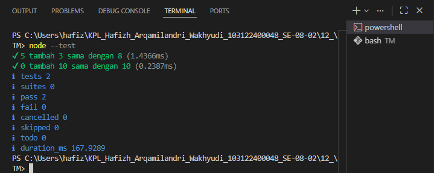

# Tugas Mandiri 12: Performance Analysis Unit Testing dan Debugging

**Nama:** Hafizh Arqamilandri Wakhyudi

**NIM:** 103122400044

**Kelas:** SE-08-02

**Soal**

Tambah dan tambah!

Fungsi di bawah ini melakukan penjumlaha pada penghitung (counter), yang sesederhana menambahk jumlah jika kamu menekan tombol.
Bisakah kamu tunjukkan apakah kode sudah benar atau bagian mana yang perlu diperbaiki beserta alasannya?

## Program/Kode

Tersedia di 
[index.js](index.js)
[hitung.js](hitung.js)
[hitung.test.js](hitung.test.js)

**Output**



**Deskripsi Program**
Untuk menyelesaikan Tugas Mandiri Modul 12 tentang Unit Testing, kita perlu membuat program sederhana berupa fungsi penjumlahan dan unit test-nya menggunakan node:test bawaan Node.js.

Membuat Fungsi Utama
Pertama, kita buat berkas hitung.js yang berisi fungsi penjumlahan.
```
// hitung.js
function tambahPengitung(terkini, jumlah) {
  terkini = terkini + jumlah;
  return terkini;
}

export { tambahPengitung };
```
Fungsi tambahPengitung(terkini, jumlah) menerima dua parameter:
terkini: nilai awal/terkini dari penghitung
jumlah: nilai yang akan ditambahkan

Fungsi ini menjumlahkan kedua parameter tersebut
Mengembalikan hasil penjumlahan

Lalu Membuat Unit Test
Selanjutnya, kita buat berkas hitung.test.js untuk menguji fungsi yang telah dibuat:
```
// hitung.test.js
import { test } from 'node:test';
import assert from 'node:assert';
import { tambahPengitung } from './hitung.js';

test('5 tambah 3 sama dengan 8', () => {
  assert.strictEqual(tambahPengitung(5, 3), 8);
});

test('0 tambah 10 sama dengan 10', () => {
  assert.strictEqual(tambahPengitung(0, 10), 10);
});
```
Mengimpor test dari node:test untuk mendefinisikan kasus uji

Mengimpor assert dari node:assert untuk melakukan asersi

test('nama test', callback) mendefinisikan sebuah kasus uji

assert.strictEqual(aktual, expected) memastikan kedua nilai benar-benar sama (===)

Konfigurasi Package.json
Agar Node.js dapat menggunakan import statement, kita perlu membuat file package.json

Untuk Menjalankan Unit Test
Jalankan unit test dengan perintah

```
node --test
```